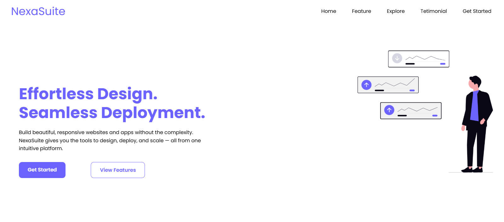

# Website 01 – Landing Page

[🌐 Visit Landing Page](https://ranim-k.github.io/Web-Projects/Day-01%20landing%20page/)

This is the fisrt web development project in serie of 10 Projects built using **HTML** and **CSS**.

## 📌 Overview

A simple landing page with:
- A navigation bar
- Headline and paragraph
- Hero image
- Google Fonts

## 💡 Purpose

This project is part of my web development learning journey.  
It helped me practice and remembring HTML structure, CSS styling, and layout basics.

## 🛠 Tools Used

- HTML5  
- CSS3  
- Google Fonts

---

✅ **Project name:** Website 01  
📚 **Category:** Learning / Practice  
