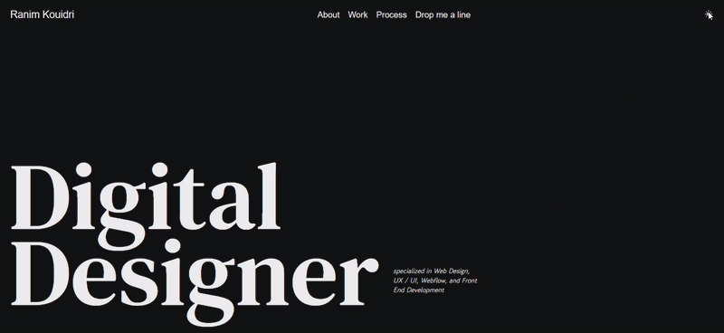

# Website 03 – Digital Designer Portfolio

[🌐 Visit Portfolio Page](https://ranim-k.github.io/Web-Projects/Day-03%20Portfolio/)

This is the third project in a 10-website development journey using **HTML**, **CSS**, and **JavaScript**.

---

## 📌 Overview

A minimalist, responsive portfolio website that introduces a **Digital Designer**.  
It features:
- Clean typography and structured layout  
- A navigation bar with links: About, Work, Process, Contact  
- A large, bold intro title ("Digital Designer")  
- A subtle description of services on the bottom right  
- Light and dark mode toggle (☀️ / 🌙)

---

## 💡 Purpose

This project focuses on building a **professional, modern landing page** to showcase personal or freelance design services.  

It gave me practical experience with:
- Typography and whitespace balance  
- Responsive layout using Flexbox  
- Implementing light/dark theme toggles with JavaScript  
- Semantic HTML structure for accessibility

---

## 🛠 Tools Used

- HTML5  
- CSS3  
- JavaScript (for theme switching)

---

✅ **Project Name:** Website 03 – Portfolio  
📚 **Category:** Portfolio / Practice  
🎨 **Fonts Used:** `Poppins`, `DM Serif Text`, or `Inter` (customizable)  
🌓 **Feature:** Dark/Light Mode Toggle  
